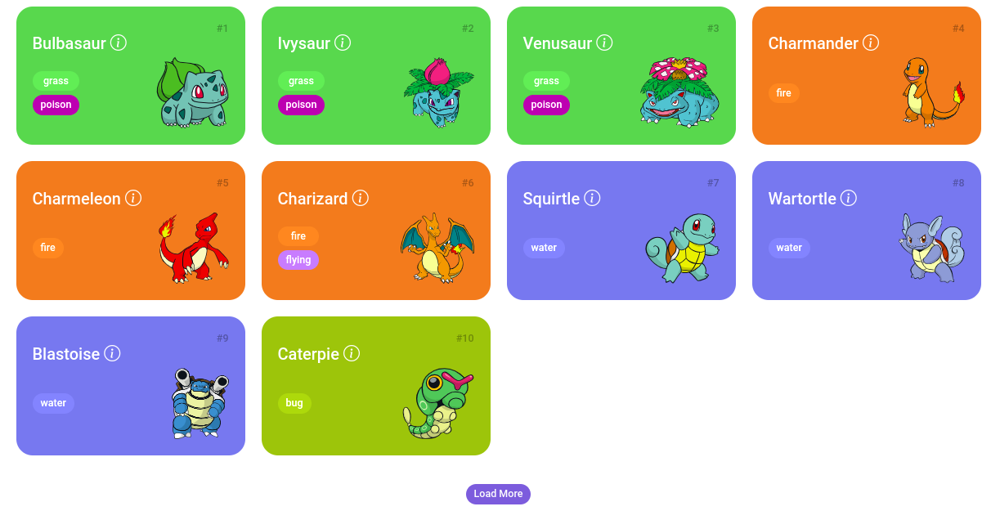

# Pokedex

Bem-vindo à Pokédex, um projeto desenvolvido durante o Santander Bootcamp 2023 - Fullstack Java + Angular.

Neste projeto, você tem a oportunidade de explorar diversos pokémons e suas respectivas evoluções, juntamente com informações detalhadas como peso, altura, níveis de ataque, defesa e pontos de vida.

A interface do projeto oferece uma experiência atraente e amigável, criada utilizando HTML, JavaScript, CSS e a coleção de ícones do Bootstrap. A imagem fornecida abaixo ilustra o projeto em funcionamento:

